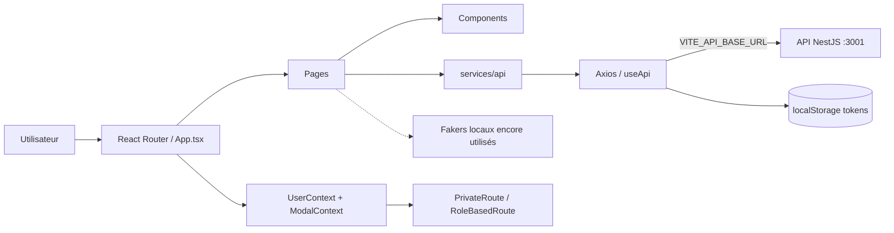

# Eduka Front — contexte Claude Code

> Référence analysée : `yeslifeprod-rgb/Eduka-front`, branche `main`, commit `08fcdd9b36179e0fc0202cbf838ae1c82e71d6e6`.
> Ce document décrit l'état réel du code. Ne pas supposer que les éléments encore simulés sont déjà connectés au back.

## Produit

Eduka est une application web scolaire organisée autour de trois rôles : parent, établissement et enseignant. Le front couvre l'authentification, les profils, les établissements, les enfants, les événements publics/privés, les participations, les notifications, la recherche et le chat.

## Stack

- React 18 + TypeScript 5
- Vite 5
- React Router 6
- Axios
- Tailwind CSS, Material UI, Material Tailwind, Bootstrap et styled-components (coexistants)
- Formik + Yup
- Mapbox et Geoapify
- Cypress pour l'E2E
- Build/deploiement : Docker multi-stage puis Nginx

## Architecture

```text
src/
├── main.tsx                 # bootstrap React + BrowserRouter
├── App.tsx                  # composition globale, providers et routes
├── pages/                   # écrans regroupés par domaine
│   ├── Login/               # connexion, email, changement de mot de passe
│   ├── Home/                # accueils parent et établissement
│   ├── Teacher/             # accueil enseignant
│   ├── Schools/             # création des utilisateurs d'un établissement
│   ├── Search/              # recherche parent/établissement
│   ├── Event/               # listes et participations
│   ├── EventPublic/         # détail événement public
│   ├── EventPrivate/        # prototypes/données privées
│   ├── CreateEvent/         # création d'événement
│   ├── Profil/              # profil et événements privés
│   ├── EditProfilBySchool/  # édition de profils/enfants
│   ├── Notification/        # notifications
│   └── Chat/                # messagerie
├── components/              # UI réutilisable par type (Card, Form, NavBar...)
├── services/
│   ├── api/                 # fonctions d'accès HTTP par domaine
│   ├── Context/             # UserContext, ModalContext, Geoapify
│   └── interfaces/          # types métier TypeScript
├── hooks/                   # useApi, useLocalStorage
└── utils/                   # routes privées, rôles, dates, fakers, helpers
```

## Flux principal



## Routage et rôles

- Route publique `/` : connexion.
- Routes publiques complémentaires : `/change_password`, `/send_email`.
- `PrivateRoute` exige un utilisateur présent dans `UserContext`.
- `RoleBasedRoute` filtre selon `user.role`.
- Rôles front : `PARENT`, `SCHOOL`, et `TEACHER` utilisé dans le routeur.
- Les routes parent couvrent événements, profil, notification, recherche, chat et création d'événement.
- Les routes établissement couvrent l'accueil et la création/recherche de profils.

## Accès API et authentification

- Utiliser l'instance Axios unique exposée par `src/hooks/useApi.ts`.
- URL racine : `import.meta.env.VITE_API_BASE_URL`.
- Le token d'accès est lu depuis `localStorage.accessToken` et envoyé en `Authorization: Bearer <token>`.
- Un intercepteur 401 tente `POST auth/refresh_token` avec `localStorage.refreshToken`, puis rejoue la requête.
- Les fonctions HTTP doivent rester dans `src/services/api/`, pas directement dans les composants.

## Contrat back attendu par le front actuel

- Authentification : le front appelle actuellement `POST auth/signInJulien`.
- Événements : `GET /event/public`, `/event/my_events`, `/event/my_participation`.
- Profil : `GET /user/profile`.
- D'autres fichiers API couvrent ajout d'événement, email, mot de passe, profils parents et upload d'image.

Attention : ces routes ne correspondent pas toutes au back actuellement présent. Vérifier le controller NestJS avant toute intégration et aligner explicitement les deux côtés.

## État réel et dette connue

- Une partie importante des écrans consomme encore les données de `src/utils/Fakers/`.
- Le fichier historique `src/utils/Axios/axios.ts` ne fait que retourner des fakers ; ne pas le confondre avec l'instance réelle `src/hooks/useApi.ts`.
- L'endpoint de connexion front (`auth/signInJulien`) diffère du back (`auth/signin`).
- `UserContext` est en mémoire : après rechargement, l'utilisateur peut disparaître même si les tokens persistent.
- Le refresh token attendu côté front n'est pas implémenté dans le back analysé.
- Plusieurs bibliothèques UI se chevauchent. Pour une correction locale, conserver le style du composant voisin ; pour une refonte, choisir une seule stratégie au lieu d'en ajouter une autre.
- Des doublons/prototypes existent (`PrivateRoute.tsx` à deux emplacements, fakers multiples, fichier `EventPrivatePage copy.tsx`). Ne pas les traiter comme architecture cible.
- Ne jamais afficher les tokens, mots de passe ou données utilisateur via `console.log`.

## Conventions pour les modifications

1. Lire la page, ses composants, son service API et les interfaces associées avant de modifier.
2. Garder les composants de page dans `pages/<Domaine>` et les composants réutilisables dans `components/<Type>`.
3. Centraliser les appels HTTP dans `services/api` via `useApi`.
4. Ajouter ou adapter les interfaces métier dans `services/interfaces` ; éviter `any`.
5. Respecter les garde-routes et les trois rôles.
6. Ne pas remplacer une API réelle par un faker. Lors d'une migration, supprimer le faker uniquement après branchement vérifié.
7. Ne pas committer de secret. Utiliser des variables `VITE_*` et maintenir un `.env.example` sans valeurs sensibles.
8. Préférer une correction ciblée aux refontes globales non demandées.

## Commandes de vérification

```bash
npm ci
npm run build
npm run lint
# E2E si l'API et les variables d'environnement sont disponibles
npx cypress run
```

Avant de terminer une tâche : vérifier le rendu concerné, les routes selon chaque rôle, les erreurs réseau et la compilation TypeScript.
